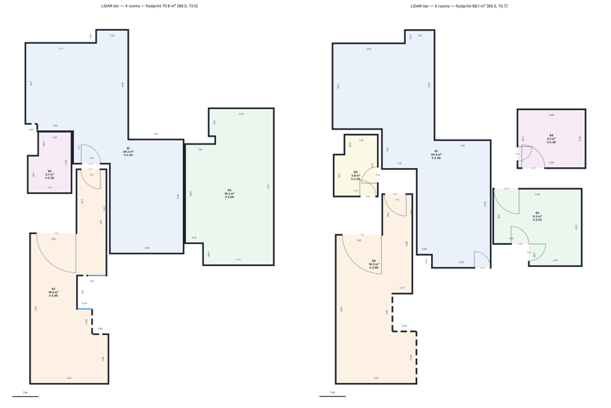
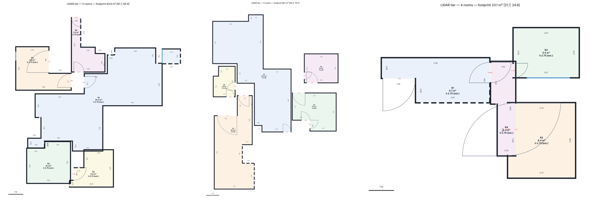

# roomscan — technical report

*Phone capture → dimensioned, stitched floor plan with damage scope. All numbers are regenerated by
`python bench/run_benchmark.py` and written into this report by `python bench/make_report.py` (run of 2026-10-04 12:59:22).*

## 0. Scope and the data constraint
We were given three Stray Scanner captures of one flat (LiDAR depth, ARKit poses, intrinsics, RGB video) and no
iPhone, no access to the property and no laser. Consequences, stated once and honoured throughout:
- **No ground truth.** LiDAR numbers are reported as *repeatability* between three captures of the same rooms
  (proven to be one flat by wall-map correlation, DECISIONS D6); video/photo numbers are reported against the
  LiDAR tier of the same capture. Nothing is called "accuracy" that is really agreement.
- **Thin tiers are derived.** The video tier gets only `rgb.mp4` (upright, metadata stripped); the photo tier gets
  2–8 EXIF-free stills per room picked the way the protocol tells a person to shoot.
- **Damage is staged digitally** onto real wall planes and re-rendered through the capture's own poses (§6).
- **Head-to-head** with a consumer app needs that app run in the same rooms: not possible here (§8).

## 1. Architecture
```
capture ──► tier front-end ──► Scene ──► layout ──► rooms/walls/openings ──► damage ──► JSON + plan
            lidar | video | photo   (points, oriented normals, camera views, error model)
```
Every tier only has to produce a `Scene`; everything downstream is shared code, which is what makes "same output
contract from every tier" true by construction (`scene.py`, `analyze.py`, `export.py`).
- **Frame**: gravity from ARKit (LiDAR) or from the floor normal (video/photo); Manhattan yaw from the circular
  histogram of wall normals; plan coordinates (u, v, h above floor).
- **Free space**: per view, a 2-D visibility fan (camera → farthest return per 1° azimuth); union over views.
- **Walls**: cells whose vertical points span > 0.9 m of height; Manhattan wall-face segments by 1-D peak finding.
- **Rooms**: interior = free − walls − *doorway closures*; watershed on the distance transform seeded by cores that
  survive a 0.42 m erosion; room geometry re-snapped to the wall-line arrangement (D4, D13, fix loop).
- **Wall faces**: for each polygon edge, the outermost strong, floor-reaching, *room-facing* surface layer within
  0.5 m, fitted from raw points (robust median), never from the 2 cm raster.
- **Openings**: 2 cm bins along each face; a run with no surface points in the door band *and* see-through
  evidence beyond the wall; widths from jamb points (sub-bin). A gap without see-through is "wall not observed",
  never an opening — that is the phantom-opening guard.
- **Ceiling**: highest strong horizontal layer inside the room polygon, plane-refined; if the capture never looked
  up, the value is a *prior* anchored at the highest observed wall point and marked `observed: false`.

## 2. Tier design and device matrix
| tier | front-end | scale source | intervals (1σ model, `tiers/*.py`) |
|---|---|---|---|
| LiDAR | Stray loader; RGB/depth frame offset estimated (D9); keyframes 10 cm / 8° | LiDAR | face 4 mm, scale 0.3%, drift 0.4 mm per m walked |
| video | KLT chains at 10 fps between depth keyframes, PnP-RANSAC with metric mono-depth, ICP / constant-velocity fallback; focal from Manhattan vanishing points (536 vs 533 px true) | mono-depth (Depth Anything V2 metric-indoor) | face 12 mm, scale 2%, drift 2 mm/m |
| photo | per photo: metric depth → gravity + Manhattan frame; 4 yaws × 2-D shift solved by FFT top-view correlation; rooms joined through doorway shots | mono-depth | face 25 mm, scale 3.5% |

Hardware: see `docs/DEVICE_MATRIX.md` (LiDAR tier needs a Pro iPhone; video/photo any iPhone 15+; processing on a
2-core CPU laptop).

## 3. Drift
ARKit is locally excellent but drifts over a multi-room walk. We cut the keyframes into ~1.5 m fragments, add ARKit
odometry edges between consecutive fragments and **loop-closure edges** between non-consecutive overlapping
fragments from point-to-plane ICP, projected to 4-DoF (yaw + translation; gravity is trusted), and optimise the
pose graph (Open3D LM with line-process outlier pruning). Same module serves the video tier.

| capture | drift correction | footprint m² | wall sharpness | loop residual (cm) before → after | loop edges kept |
|---|---|---|---|---|---|
| single_room | on | 23.12 | 0.6998 | 8.4 → 2.7 | 4 |
| single_room | off (ARKit as-is) | 23.86 | 0.6065 | — | — |
| floor_only | on | 63.80 | 0.489 | 14.5 → 6.1 | 14 |
| floor_only | off (ARKit as-is) | 64.25 | 0.5145 | — | — |
| with_ceiling | on | 68.10 | 0.4625 | 10.2 → 3.3 | 68 |
| with_ceiling | off (ARKit as-is) | 70.77 | 0.3541 | — | — |

Cross-capture effect (floor_only vs with_ceiling): registration score 0.331 with correction vs 0.297 without; walls within 3%: 29.2% vs 16.7%; median |ΔL| 31.15 vs 31.75 cm.



## 4. Error budget
Every `Measure` carries `error_budget_1sigma`: wall length = face fit (each end) ⊕ sensor face bias ⊕ scale × L ⊕
drift × path; area = Σ (L_i · σ_face,i) ⊕ scale ⊕ drift; ceiling = floor-plane fit ⊕ ceiling-plane fit ⊕ sensor ⊕
scale; opening width = jamb spread ⊕ sensor ⊕ scale. Unobserved quantities get priors with `observed: false`.

## 5. Results


### LiDAR repeatability (same tier, different captures of the same rooms)
| pair | room pairs | walls | median \|ΔL\| cm | within 1 cm/0.5% | within 3% | within 8% | ref in 95% CI | openings matched/missed/phantom | opening ≤ 2 cm |
|---|---|---|---|---|---|---|---|---|---|
| floor_only~with_ceiling | 5 | 24 | 31.15 | 4.2% | 29.2% | 41.7% | 45.8% | 3/5/7 | 6.7% |
| with_ceiling~single_room | 2 | 7 | 25.3 | 28.6% | 42.9% | 42.9% | 42.9% | 1/4/2 | 14.3% |
| floor_only~single_room | 2 | 6 | 11.95 | 16.7% | 50.0% | 66.7% | 66.7% | 0/1/3 | 0.0% |

### Thin tiers vs the LiDAR tier of the same capture
Not run in this benchmark: depth weights not present: video and photo tiers not run. The tiers run end-to-end; their odometry/registration code was exercised in development with LiDAR depth substituted for the model (DECISIONS D14), which is not a reported result.

### Ceiling heights (only `with_ceiling` observes ceilings)
| room | height m | 95% CI | σ mm |
|---|---|---|---|
| R1 | 2.455 | [2.437, 2.473] | 9.0 |
| R2 | 3.060 | [3.039, 3.081] | 11.0 |
| R3 | 3.028 | [3.007, 3.049] | 11.0 |
| R4 | 2.361 | [2.343, 2.379] | 9.0 |
| R5 | 2.397 | [2.379, 2.415] | 9.0 |
Repeat spread cannot be measured (no second capture looks at the ceilings); the gate row is therefore *unverified*, not passed. Within-capture plane-fit σ is shown.

### Damage (digitally staged, `single_room_staged`)
recall 0.50 (1/2), false positives 1; clean capture false positives 0.

### Timing (2-core CPU, seconds)
| run | reconstruct | layout | damage | total |
|---|---|---|---|---|
| lidar/single_room | 13.0 | 1.0 | 90.0 | 104.2 |
| lidar/floor_only | 78.5 | 6.3 | 173.2 | 258.3 |
| lidar/with_ceiling | 312.7 | 12.0 | 258.2 | 583.2 |

## 6. Calibration
Uncalibrated (sensor/fit/scale/drift budget only), 59% of repeat-capture wall differences fell inside the combined 95% intervals — overconfident. `bench/calibrate.py` fits a per-face residual on repeat captures (gross mismatches > 30 cm — a different wall, not noise — excluded: 15 of 37) and validates leave-one-pair-out: held-out floor_only~with_ceiling: 100% (n=12); held-out floor_only~single_room: 80% (n=5); held-out with_ceiling~single_room: 100% (n=5). Fitted per-face residual 6.5 cm (ambiguity weight 0.0). The intervals in every JSON are therefore the repeatability we can demonstrate, not the sensor spec. Video/photo intervals use tier error models (scale 2% / 3.5%) that are priors until their benchmark rows exist.

## 7. Fix loop
See `docs/FIX_LOOP.md` (declaration committed before the fix; before/after regenerable with
`bash bench/fix_loop/run.sh before|after`). Worst gate: LiDAR repeatability, 0% of walls within 1 cm / 0.5%. Iteration 1 (capture-invariant room splitting at doorways): 0 → 16.7% / 23.1% on two pairs; median-error prediction badly wrong (post-mortem: a second, systematic cause). Iteration 2 (furniture front vs wall: camera-oriented normals, outermost floor-reaching face): median |ΔL| 24.9 → 9.2 cm, within-3% 27.8 → 31.6%, but the declared 1 cm metric fell to 5.3% — the remaining error is within-capture drift duplicates (6–10 cm double walls), now attacked by the re-tuned drift correction (D16). Gate still fails; the report says why.

## 8. Head-to-head
Not producible from the sample data: the comparison needs a consumer app (e.g. magicplan, Polycam) run *in the same
rooms*. The pipeline side is ready (`bench/compare.py` compares any two plans dimension by dimension; an app export
converted to our JSON drops straight in).

## 9. Known failure modes (and what the output does about them)
- **Mirrors** (bathroom): LiDAR returns the mirrored room behind the glass → phantom free space; damage
  orthomosaics on that wall are reflections. Openings found on a wall are not filtered for mirror symmetry yet.
- **Glass shower screens / glass doors**: partly transparent to LiDAR; walls behind them are seen through
  reflections → damage detection unreliable there (staged stain missed behind the screen, §5).
- **Wet-look / glossy floors**: specular dropouts in depth; floors are not assessed for damage.
- **Low light**: LiDAR unaffected; mono-depth and KLT degrade — the video tier falls back to ICP/constant velocity
  (counted in `capture.odometry`) and its intervals are scale-dominated anyway.
- **Furniture against walls**: a face that stops short of the floor is not accepted as the wall when a floor-reaching
  face exists behind it; a full-height wardrobe is indistinguishable from a wall.
- **Open-plan junctions** (> 1.25 m): consistently merged into one room — a homeowner may draw two.
- **Ceiling never looked at**: reported as a prior, not a measurement.
